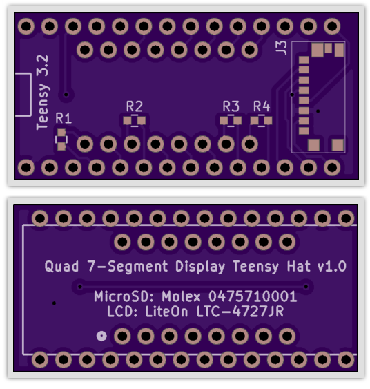
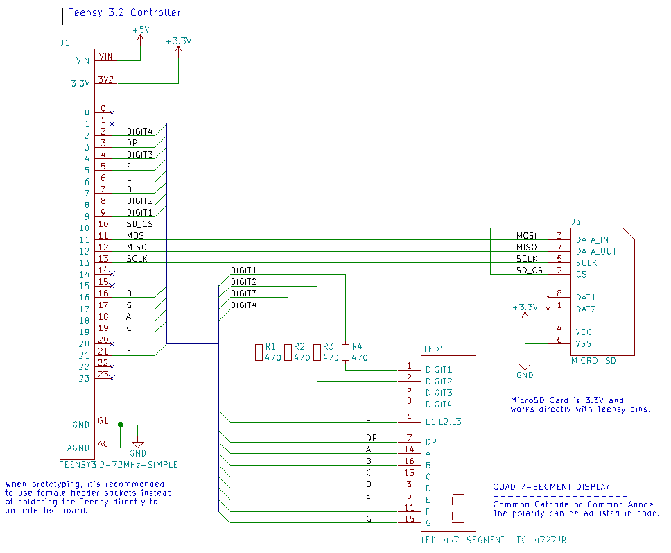

# 7-Segment Display Teensy Hat

7-Segment display daughter board for the Teensy 3.2.

I'll share the boards at OSH Park when the design is verified. You can buy a set of three for $5.20.

|Ref|Qty|Description|MF_Name|MF_PN|Digikey|
|---|---|-----------|-------|-----|-------|
|J3|1|CONN MICRO SD CARD HINGED TYPE|Molex|5009010801|WM19081CT-ND|
|LED1|1|LED DISPLAY 4CHAR 7SEGMENT COMMON CATHODE LTC-4727JR|LITE-ON|LTC-4727JR|160-1551-5-ND|
|R1-R4|4|RES SMD 470 OHM 5% 1/4W 0603|Rohm Semi|ESR03EZPJ471|RHM470DCT-ND|

The best way to place the LCD 7-Segment Display and the Teensy 3.2 is to buy one 40-position header (it's the cheapest option, about $0.50) and snap it apart into the sections you need.

The Teensy 3.2 can be bought from OSH Park at checkout, or from <a href="http://pjrc.com/store/teensy32.html">PJRC</a>.
