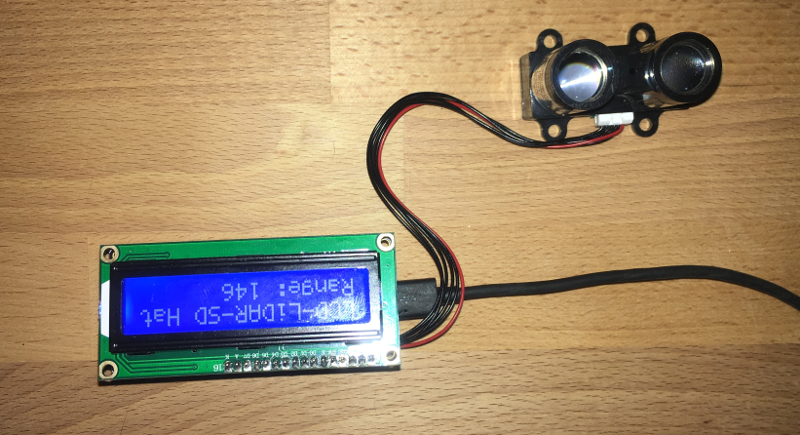
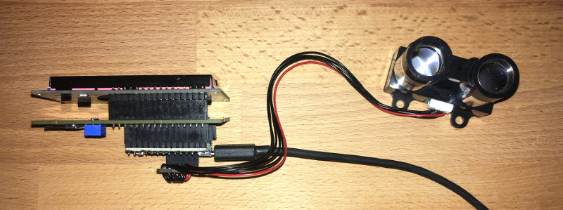
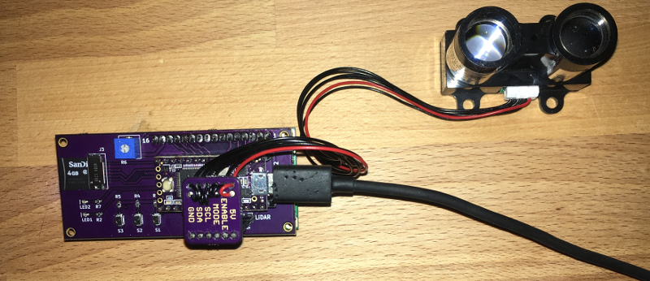

# LCD-LiDAR-SD Teensy Hat

LiDAR board with LCD screen and SD card for logging. 

The project is released as open hardware under the CERN v1.2 Open Hardware license.

It uses a LiDAR-Lite v1 or v2 for the rangefinder, and it supports the I2C and PWM modes. The project uses the KiCad Teensy template and footprint from <a href="http://wickerbox.net/wickerlib">wickerlib</a>. 

I've shared the project at OSH Park so you can buy a set of three bare boards for $22.55.

The Teensy 3.2 is available at <a href="http://pjrc.com/teensy/index.html">PJRC.com</a> or at OSH Park as an add-on at checkout.

I'm using a standard <a href="https://www.adafruit.com/product/181">16x2 LCD screen from Adafruit</a>, but you can also get them from Amazon.

The rest of the parts are available at <a href="http://digikey.com">Digikey</a>.

|Ref|Qty|Description|Manuf|Mfr PN|Source PN|
|---|---|-----------|-----|------|---------|
|J2|1|HEADER FEMALE 6POS TH 1x06 0.1”|Harwin|M20-7820642|952-1808-ND|
|J3|1|CONN MICRO SD CARD |Molex|0475710001|WM9731CT-ND|
|LED1-2|2|LED AMBER DIFFUSED 0603 SMD|OSRAM Opto|LA L296-Q2R2-1-Z|475-2712-1-ND|
|R1-R5,R7|6|RES SMD 1K OHM 1% 1/10W 0603|Samsung|RC1608F102CS|1276-3484-1-ND|
|R6|1|TRIMMER 10K OHM TH |Bourns| 3362U-1-103LF|3362U-103LF-ND|
|S1-S3|3|SWITCH TACTILE SPST-NO 0.05A 12V|Omron|B3U-1000P|SW1020CT-ND|

