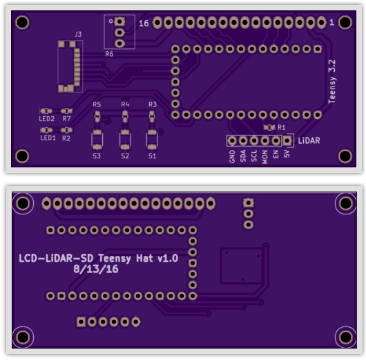
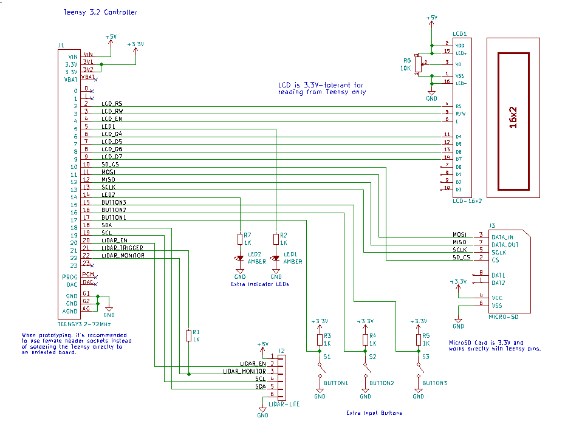

# LCD-LiDAR-SD Teensy Hat

LiDAR board with LCD screen and SD card for logging. Based on the LiDAR-Lite v1 and v2.

|Ref|Qty|Description|Manuf|Mfr PN|Source|Source PN|
|---|---|-----------|-----|------|------|---------|
|J1|1|TEENSY 3.2 32BIT 72MHZ|PJRC|TEENSY3.2|PJRC|TEENSY3.2|
|J2|1|HEADER FEMALE 6POS TH 1x06 0.1”|Harwin|M20-7820642|Digikey|952-1808-ND|
|J3|1|CONN MICRO SD CARD |Molex|0475710001|Digikey|WM9731CT-ND|
|LCD1|1|LCD MODULE 16X2 CHARACTER|Tinsharp|TC1602A-09T|Adafruit|181|
|LED1-2|2|LED AMBER DIFFUSED 0603 SMD|OSRAM Opto|LA L296-Q2R2-1-Z|Digikey|475-2712-1-ND|
|R1-R5,R7|6|RES SMD 1K OHM 1% 1/10W 0603|Samsung|RC1608F102CS|Digikey|1276-3484-1-ND|
|R6|1|TRIMMER 10K OHM TH |Bourns| 3362U-1-103LF|Digikey|3362U-103LF-ND|
|S1-S3|3|SWITCH TACTILE SPST-NO 0.05A 12V|Omron|B3U-1000P|Digikey|SW1020CT-ND|
