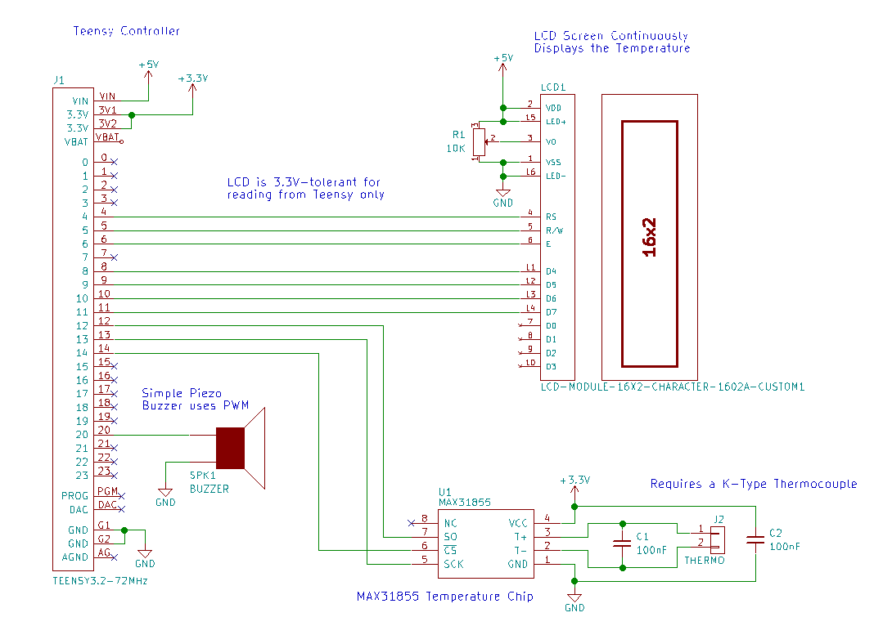
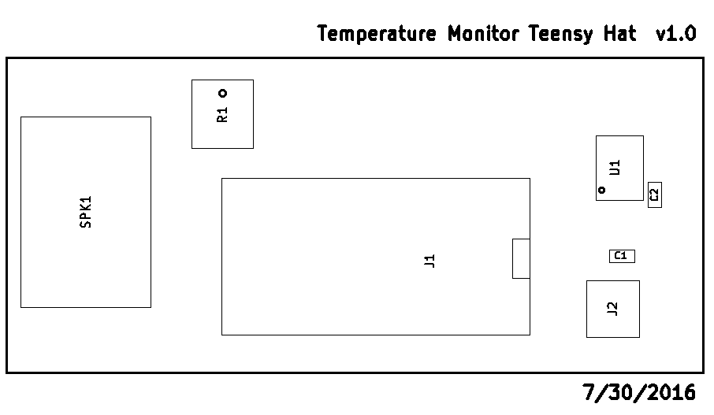

# Temperature Monitor LCD Teensy Hat

Simple monitor hat with an LCD screen that displays current temperature as sensed by K-type thermocouple through the MAX31855 junction-compensated sensor chip. The board also buzzes at certain preset temperatures. 

|Ref|Qty|Description|Manufacturer|Mfr PN|Vendor|Vendor PN|
|---|---|-----------|------------|------|------|---------|
|J1|1|TEENSY 3.2 32BIT 72MHZ|PJRC|TEENSY3.2|PJRC|TEENSY3.2|
|U1|1|IC CONV THERMOCOUPLE MAX31855 SOIC8|Freescale NXP|MAX31855KASA+|Digikey|MAX31855KASA+-ND|
|LCD1|1|LCD MODULE 16X2 CHARACTER 1602A|Tinsharp|TC1602A-09T|Adafruit|181|
|C1;C2|2|CAP CER 0.1UF 100V X7R 0603|Murata|GRM188R72A104KA35D|Digikey|490-3285-1-ND|
|J2|1|CONN TERM SCREW GREEN 2.54MM 2POS TH|OnShoreTech|OSTVN02A150|Digikey|ED10561-ND|
|R1|1|TRIMMER 10K OHM TH|Bourns|3362U-1-103LF|Digikey|3362U-103LF-ND|
|SPK1|1|BUZZER ONE NOTE 3V 4KHZ PIEZO SMT|CUI Inc|CMT-1603-SMT-TR|Digikey|102-1193-1-ND|

